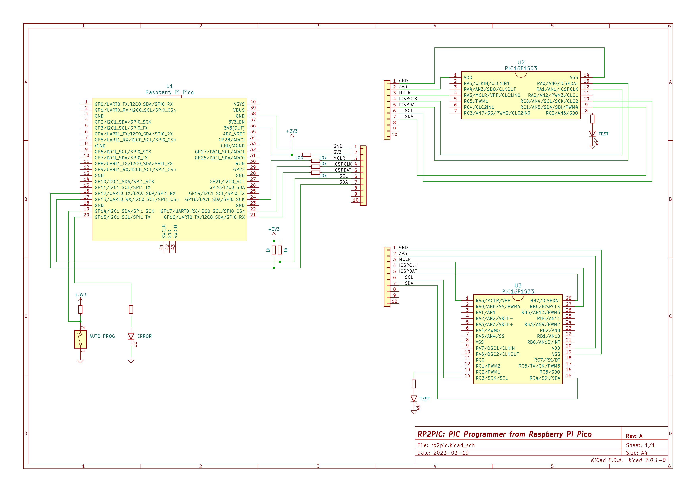

# RP2PIC

A PIC Programmer by Raspberry Pi Pico and the cousins


RP2PIC runs on [circuitpython](https://circuitpython.org/).

This project is based on a [blog article](https://ameblo.jp/lonetrip/entry-12763727309.html). Thanks!

## Features

- [Command Mode](#command-mode)
- [Auto-Programming Mode](#auto-prog-Mode)
- [I2C Debugging utility](#i2c-debug-utility)

## Hardware


For now I've just built it on a breadboard, but I'm going to make dedicated PCBs when I have time.

## Supported Devices

|Device|Support|Note|
|:---|:---:|:---|
|16f1503|yes|not checked data memory|
|16f1933|not yet||


## Software Install

### 1. Install Circuitpython
1. Download Circuitpython UF2 from [https://circuitpython.org/downloads](https://circuitpython.org/downloads)

1. Press button BOOTSEL on Raspberry Pi Pico
1. Connect USB cable to Raspberry Pi Pico
1. Release button BOOTSEL on Raspberry Pi Pico
1. Copy UF2 to `RPI-RP2`
1. After a while, `CIRCUITPY` should be appeared instead of `RPI-RP2` 

### 2. Install Library

RP2PIC requires a library function `adafruit_datetime.mpy`.
It has to be download and installed under the directory `/lib` on the device. 

1. download `adafruit-circuitpython-bundle-NN.x-mpy-YYYYMMDD.zip` from [https://circuitpython.org/libraries](https://circuitpython.org/libraries).

1. copy `adafruit_datetime.mpy` in the zip into the folder `/CIRCUITPY/lib`

### 3. Install RP2PIC
1. copy `rp2pic.py` into `CIRCUITPY`
1. rename it to `code.py`

## Usage
Copy the .hex file directly under `/CIRCUITPY/` then RP2PIC will recognize it. RP2PIC checks the timestamp of the all .hex file.

RP2PIC has two modes.

|Mode|PIN_SW_AUTO|
|:---|:--:|
|Command Mode| High|
|Auto-Prog Mode| Low|

### Command Mode

Command Mode can be Program/Erase/Verify by CUI through USB serial terminal such like gnu screen, minicom, teraterm, etc.

To show command help, type `h` at the top-level prompt `>`.

Head 3 lines on help shows current status such as Auto-Prog, Target device name, .hex filename currently selected. The following lines show each programmer commands.

```
# PIC16F1xxx LV-ICSP Programmer
waiting hex...
> h
Auto Prog : No
Device    : PIC16F1503
File      : 16f1503_blink_intosc.hex    2023-4-26 18:13:4

MI/MO     : Enter/Exit LV-ICSP Mode                  (White)
RP/RD/RC  : Read   Program/Data/Configuration Memory (Green)
EP/ED     : Erase  Program/Data               Memory (Yellow)
WP/WD/WC  : Write  Program/Data/Configuration Memory (Red)
VP/VD/VC  : Verify Program/Data/Configuration Memory (Cyan)
```

### Auto-Prog Mode

Auto-Prog Mode behaves as an automatic programmer. You can program it into PIC just by Drag and Drop a hex file.

### I2C Debug Utility

If you only test a simple circuit using I2C, you can input I2C commands to the device from the host PC and check the response while the RP2PIC is connected.

To use the I2C debug utility, type `i2c` at the top level prompt `>`. A new prompt (e.g. `I2C 0x2f>`) shows the slave address of the device debugging now.

To show command help, type `h` at the i2c prompt `i2c 0xXX>`.

```
# PIC16F1xxx LV-ICSP Programmer
waiting hex...
> i2c
I2C 0x2f> h
e.g. help          : Print examples for all I2C Utility
     help w        : Print examples for "w" commands
     h             : <alias>
     ?             : <alias>
e.g. exit          : Exit from I2C Utility
     quit          : <alias>
     !!!           : <alias>
e.g. reset         : Reset target device
e.g. scan          : Scan I2C bus then list slave addresses
e.g. addr 42       : Set 0x42 as target device
     addr          : Show target device currently set
e.g. w C4 2 15     : Write data "0xC4 0x02 0x15" to target device
     w             : Write to target device without any data
     s             : <alias>
e.g. r 8           : Read 8 bytes from target device
     r             : Read 1 byte from target device
e.g. wr 2 C2 5 10  : Write data "0x02 0xC2 0x05" to target device,
                   :  then read 10 bytes from target device
     wr 10         : Write to target device without any data,
                   :  then read 10 bytes from target device
     wr            : Write to target device without any data,
                   :  then read 1 byte from target device
```

## TODO
- [ ] cleanup command loop
- [ ] dedicated pcb
- [ ] spi debug utility
- [ ] uart debug utility

## Links

- [XIAO RP2040で PIC12F1822ライタの製作](https://ameblo.jp/lonetrip/entry-12763727309.html)
